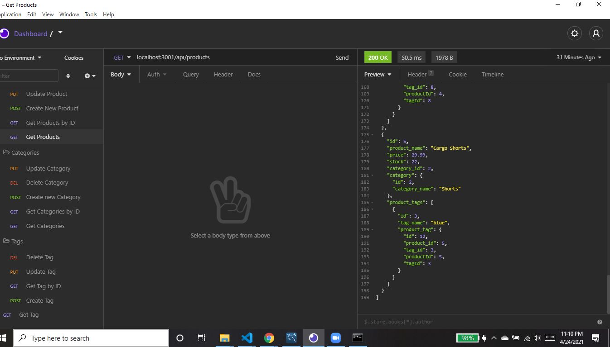

# e-commerce-back-end
 
  ===========================================
    
  ## Description 
      This is an example of the back end that would be utilized on an e-commerce site.  Using starter code, a Express.js API was established and MySQL2 and Sequelize packages were used to connect it to a MYSQL database.  The dotenv package was used to store password, username, and database info.
  ## Table of Contents 
  - [Installation](#installation)
  - [Usage](#usage)
  - [Contributions](#contributions)
  - [Questions](#questions)
  - [License](#license)
  ## Installation 
      Install Inquirer package using npm install in the command line.  
  ## Usage 
      To begin, create the database using MYSQL shell commands or MYSQL Workbench.  Rename the .env.example file to ".env"  Enter your MYSQL user and password information in the .env file and save. Using npm run seed in the command-line, you can seed the database with the provided seed files for testing operation, or replace them with seed files of your own data.

      Invoke npm start while in the directory with the repository for this app. This will start the app's server and sync the Sequelize models to the MySQL database. View the screenshot and videos below for examples of testing this app using Insomnia.

View this [video](https://drive.google.com/file/d/1JwgF6nQzSOg37rsQiP0IvOvwNjkArmrc/view) as an example. 

  ## Contributions 
This was created by:
* kellyjohnson364: [https://github.com/kellyjohnson364](https://github.com/kellyjohnson364)
            
            
            
Please feel free to contribute to this project.
           

## Questions 
If you have questions or feedback, please contact kellyjohnson364 at [https://github.com/kellyjohnson364](https://github.com/kellyjohnson364) or via email at kj3641402@gmail.com.

## License
This project is licensed under The Unlicense.
For more info click [The Unlicense](./assets/licenses/theunlicense.md).